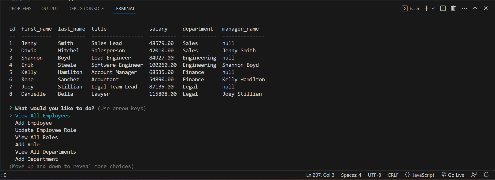

# Employer-CMS-Tool

## Table of contents
​
- [Overview](#overview)
 - [The challenge](#the-challenge)
 - [Screenshot](#screenshot)
 - [Links](#links)
- [My process](#my-process)
 - [Built with](#built-with)
 - [What I learned](#what-i-learned)
 - [Continued development](#continued-development)
 - [Useful resources](#useful-resources)
- [Author](#author)
- [Acknowledgments](#acknowledgments)
​
## Overview
​
### The challenge
​
Users should be able to:
​
- create a terminal based prompt with Node that can display and change data from SQL files
- Use MySQL and a connection to complete those changes
- use Javascript, Node.js, SQL and Mysql, npm to install correct dependancies
​
### Screenshot

​

### Links
​
- Project GitHub Repo: [https://github.com/appleschaussaa/Employer-CMS-Tool]
​
## My process
​
### Built with
​
- NPM/Node.js
- SQL/MySQL
- Javascript
​
### What I learned
​
This was quite an interesting module to return to after moving on to more intuitive thing like MongoDB and NoSQL. I have been toying with it for awhile to rifine it the best I could before resubmitting. MySQL and this style of SQL is pretty fun to use still, just requires a lot more code to do some things especially in the case of creating a new employee where it accesses all the tables and pull out the names of other employees for managers.
​
### Continued development
​
I didnt really get around to styling it in an cool way especially at the initial menu or I saw that Inquirer provides some cool font colors and basic animations that would have been fun to impliment
​
### Useful resources
​
- [Example resource 1](https://www.w3schools.com/sql/sql_ref_keywords.asp) - Helpful resource when working with SQL
- [Example resource 2](https://dev.mysql.com/doc/refman/8.0/en/fixed-point-types.html#:~:text=Standard%20SQL%20requires%20that%20DECIMAL,DECIMAL(%20M%20%2C0)%20.) - decimals werent covered in the link above.
- [Example resource 3](https://developer.mozilla.org/en-US/docs/Web/API/console/table) - helps learn how to use console.table
- [Example resource 4](https://www.mysqltutorial.org/mysql-cheat-sheet.aspx) - kept this around in my browser as a reminder
- [Example resource 5](https://morioh.com/p/0b9636237f5c) - similar to the npm inquirer page but better displayed and examples.
- [Example resource 6](https://www.digitalocean.com/community/tutorials/how-to-use-the-switch-statement-in-javascript) - Really was confused on how to proceed after creating the beginning to the mainMenu prompt but this helped. Seemed better than a bunc of If Else statements.
- [Example resource 7](https://www.w3schools.com/nodejs/nodejs_mysql.asp) - since this project is local based and are not using routes, this helped with connecting.
- [Example resource 8](https://www.npmjs.com/package/inquirer) - This was nice to go back and refresh my memory. Especially nice for the order of a successfull prompt: .prompt -> questions, .then -> feedback .catch -> what went wrong
- [Example resource 9](https://www.sitepoint.com/using-node-mysql-javascript-client/) - This was a very helpful guide and gave a god amount of ideas for querying`

## Author

 Robert Schauss
- GitHub - [appleschaussaa](https://github.com/appleschaussaa)

## Acknowledgments

I have to give it up to the TAs for initially getting me on the right path. After initially submitting one of them help me out on an issue I kept getting and gave me some great tips. 